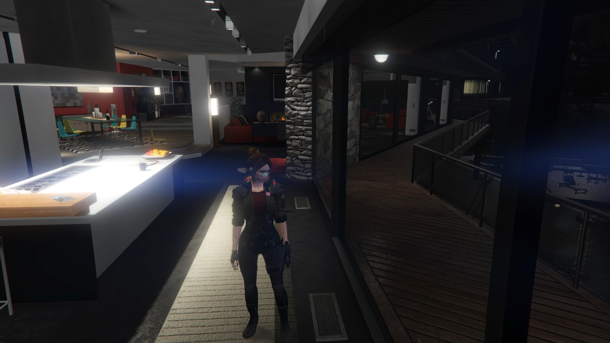

# This is Grand Theft Auto V script
___
## Description
This mod would be usefull, if u have a V model by [alex189](https://www.gta5-mods.com/users/alex189?fbclid=IwAR1TaGXscI_5Uo4tROwRwQ14tUxYOw7nqhUEsavLxW3141DR0_aXk3vfLno).
The mod changing some character's parameters like voice, animation and clothes.

After the using the mod, the model will be have that view

___

## Requirements
1. ScriptHookV - [Download](http://dev-c.com/gta/scripthookv)
2. ScriptHookVDotNet - [Download](https://github.com/crosire/scripthookvdotnet/releases)

## Installation
1) You must to have that model. It can download from the [SITE](https://www.gta5-mods.com/player/cyberpunk-custom-female-ped-add-on-ped-replace), and add the model to GTA V. See an [INSTRUCTION](https://www.gta5-mods.com/scripts/addonpeds-asi-pedselector).
3) Move a CustomPlayer_Vi.dll to "rootGTAVFolder/scripts/". If you don't have that folder, just create it.
4) Well done!

## Control
K - click on the button to customize V or return initial model.

## Warning !
If you will save game with non default model, its lead to crash the game when you start GTA V again or make your save game to trash.
