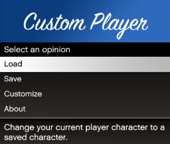
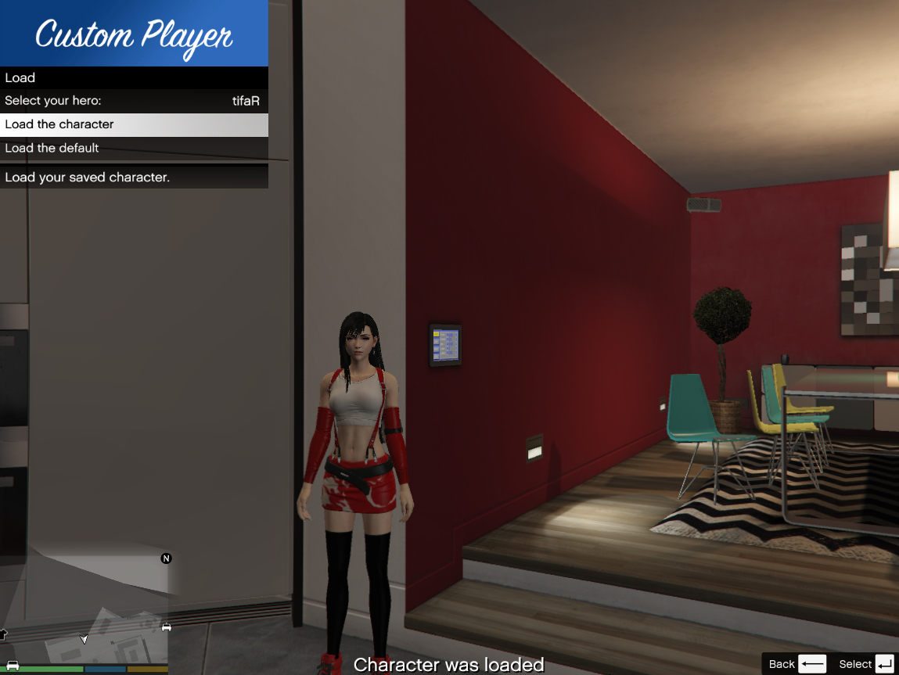
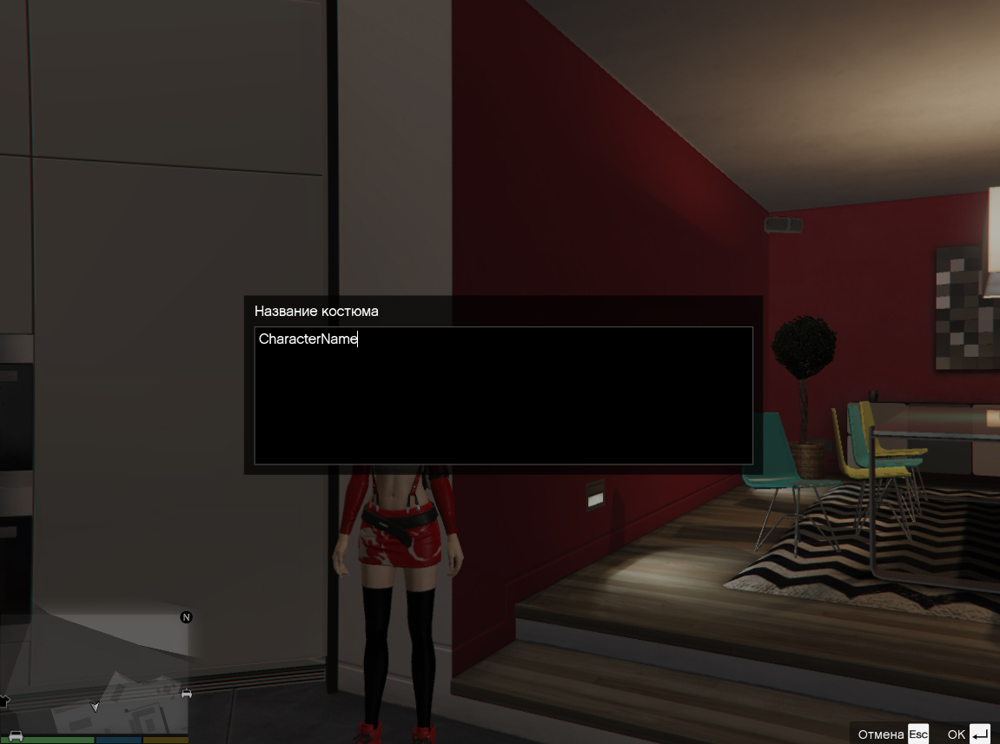
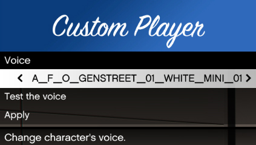
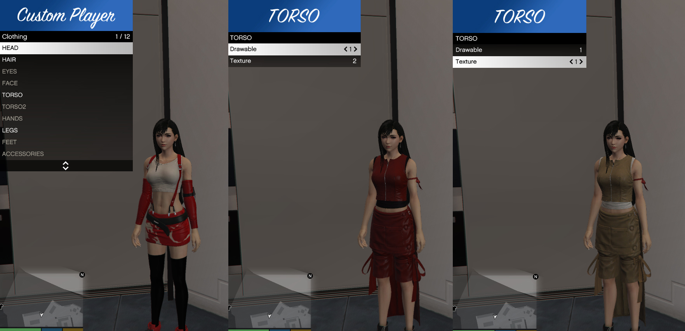

# About Custom Player
Custom Player (or CustomPlayer) is a mod for Grand Theft Auto V. With help of this mod you can change some things of your character: clothing and voice. Also you can save and load your customized hero. This mod has an intuitive user interface by NativeUI library.

# Overview
## Main Menu

## Load Menu

This is a menu of a character loading. If you have have a saved character already, there will be a list of your characters.

## Saving

To save your hero, you just need to type a name of character's suit or something like that.

## Voice menu

In this menu you can choose a voice for your character, listen it and apply new voice.

## Clothing Menu

There you can change a clothing of your hero. For this your need to choose a component and you can change drawable things and textures of them.

## Video

___

+ If you using an add-on model and you will save game with no default model like Franklin or Michael or Trevor, your save gonna be broken and it can lead to crash or infinity loading.

+ Also when your add-on character is dying, the mod would replace current model to the model which that was during the launch of GTA V. This will save you endless loading.

+ And also, for some add-on models clothing components can be swapped. For example gloves can be changed through the "Legs" menu. These are the features of the add-on models.
